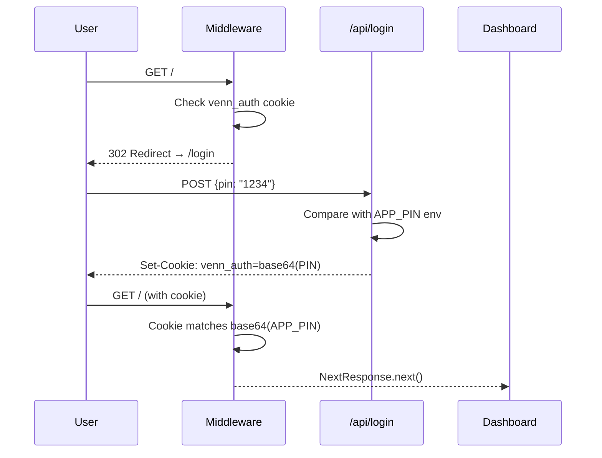
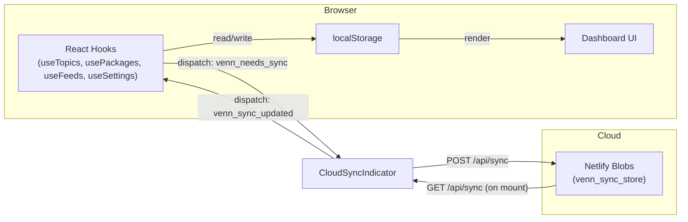
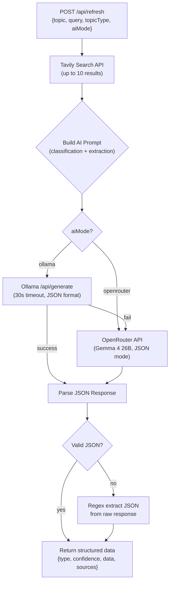

# ⚡ VENN — Complete Architectural Analysis

## 1. What Is Venn?

Venn is a **self-hosted, AI-powered Personal Intelligence Dashboard**. It lets a user track arbitrary topics (news, movies, tech), monitor software packages (PyPI, npm, VS Code), subscribe to RSS feeds, and view ambient data widgets (weather, markets, ISS position, GitHub activity) — all through a terminal/command-center aesthetic.

> **Core Philosophy**: "Track anything. Own your data." — offline-first localStorage with optional Netlify Blobs cloud sync.

---

## 2. Technology Stack

| Layer | Technology | Notes |
|---|---|---|
| **Framework** | Next.js 14 (Pages Router) | `reactStrictMode: true` |
| **Styling** | Tailwind CSS 3.4 + Google Fonts | IBM Plex Mono + Space Mono |
| **Drag & Drop** | @dnd-kit/core + @dnd-kit/sortable | Cards are reorderable |
| **AI (Cloud)** | OpenRouter → `google/gemma-4-26b-a4b-it` | Free tier |
| **AI (Local)** | Ollama (any model, prefers Gemma 3) | Auto-detected on startup |
| **Search** | Tavily Search API | 1000 free credits/mo |
| **RSS** | `rss-parser` (server-side) | Proxied through API route |
| **Cloud Sync** | `@netlify/blobs` | Single-key JSON store |
| **Hosting** | Netlify (Functions + Next.js plugin) | `netlify.toml` config |
| **PWA** | Service Worker + Web App Manifest | Cache-first for static, network-first for API |
| **Auth** | Custom PIN → HttpOnly cookie + middleware | Base64-encoded PIN in cookie |
| **Markdown** | `react-markdown` | Used in ChatModal for AI responses |

---

## 3. Project Structure

```
venn/
├── pages/
│   ├── _app.js                    # Global layout: viewport meta, PWA manifest, scanline overlay
│   ├── index.js                   # 690-line Dashboard page — the entire app orchestrator
│   ├── login.js                   # Terminal-styled PIN entry screen
│   └── api/
│       ├── login.js               # POST: validate PIN, set HttpOnly cookie
│       ├── logout.js              # POST: clear auth cookie
│       ├── refresh.js             # POST: Tavily search → AI extraction → structured JSON
│       ├── chat.js                # POST: conversational AI (Ollama → OpenRouter fallback)
│       ├── packages.js            # POST: fetch stats from PyPI / npm / VS Code Marketplace
│       ├── rss.js                 # POST: fetch + parse RSS/Atom feeds
│       ├── sync.js                # GET/POST: Netlify Blobs cloud sync
│       └── space-pulse.js         # GET: NASA APOD + ISS telemetry (proxied)
│
├── components/
│   ├── TopicCard.js               # AI-tracked topic card (briefing or cinema widget)
│   ├── PackageCard.js             # PyPI/npm/VS Code package stats card
│   ├── FeedCard.js                # RSS feed card with article list
│   ├── BriefingWidget.js          # "briefing" type renderer (summary, key points, sentiment)
│   ├── CinemaWidget.js            # "cinema" type renderer (box office, cast, countdown)
│   ├── ErrorWidget.js             # Parse-error fallback with debug view
│   ├── ChatModal.js               # Full-screen chat overlay per topic
│   ├── AddTopicForm.js            # Form: add topic (name, type, custom query)
│   ├── AddPackageForm.js          # Form: add package (name, platform, identifier)
│   ├── AddFeedForm.js             # Form: add RSS feed (name, URL)
│   ├── SettingsPanel.js           # AI, widget, chat, weather, data management settings
│   ├── CloudSyncIndicator.js      # Bidirectional cloud sync status dot
│   ├── ConfirmDialog.js           # "Are you sure?" modal for stale-cache syncs
│   ├── Toast.js                   # Imperative toast system (showToast global function)
│   └── sidebars/
│       ├── LeftSidebar.js         # Container: Calendar, Weather, Markets, DataTicker
│       ├── RightSidebar.js        # Container: WorldClock, GitHub, SpaceWatch
│       ├── MiniCalendar.js        # Interactive monthly calendar
│       ├── WeatherWidget.js       # Open-Meteo weather (auto geolocation or manual city)
│       ├── MarketWatch.js         # Forex (USD/INR), Crypto, Gold/Silver prices
│       ├── WorldClock.js          # LOCAL / UTC / NYC / TYO + UNIX epoch
│       ├── GithubWidget.js        # GitHub profile stats + recent activity
│       ├── SpaceWatch.js          # NASA APOD image + ISS live telemetry
│       ├── DataTicker.js          # Rotating "system log" aesthetic text
│       └── SystemIndicators.js    # JS heap memory + network status bars (unused in sidebars)
│
├── lib/
│   ├── useTopics.js               # Hook: topics CRUD + localStorage + cache + cloud sync events
│   ├── usePackages.js             # Hook: packages CRUD (identical pattern to useTopics)
│   ├── useFeeds.js                # Hook: feeds CRUD (identical pattern, 1h TTL)
│   ├── useSettings.js             # Hook: settings + Ollama auto-detection + model selection
│   ├── useMarkets.js              # Hook: forex/crypto/commodity data (10-min poll)
│   └── widgetRegistry.js          # Topic type → component mapping (cinema, briefing, error)
│
├── netlify/functions/
│   ├── refresh.js                 # Duplicate of pages/api/refresh.js for Netlify Functions format
│   └── chat.js                    # Duplicate of pages/api/chat.js for Netlify Functions format
│
├── middleware.js                  # Next.js edge middleware: PIN auth gate on all routes
├── styles/globals.css             # Design system: fonts, scanlines, scrollbars, skeletons, status dots
├── tailwind.config.js             # Custom colors, fonts, animations
├── next.config.js                 # Minimal (reactStrictMode only)
├── netlify.toml                   # Build config, CORS headers, plugin
├── public/
│   ├── manifest.json              # PWA manifest
│   ├── sw.js                      # Service worker (cache-first static, network-first API)
│   ├── icon-192.svg / icon-512.svg
│   └── ...
├── .env.example                   # Template for required env vars
└── package.json
```

---

## 4. Architecture Deep Dive

### 4.1 Authentication Layer



**Dual-layer auth**:
1. **Server-side**: Next.js `middleware.js` checks the `venn_auth` HttpOnly cookie against `base64(APP_PIN)` on every request. Exempts `/login`, `/api/login`, and static assets.
2. **Client-side**: `index.js` checks `venn_session` in localStorage (with 24h expiry) as a fast redirect guard.

### 4.2 Data Architecture — "Pure Uplink" Pattern

The app uses a **localStorage-first** architecture with optional cloud backup:



**Key localStorage keys**:
| Key | Content |
|---|---|
| `venn_topics` | Array of topic objects `{id, topic, query, topicType, createdAt}` |
| `venn_cache` | Map of `topicId → {data, sources, type, cachedAt, usedProvider, ...}` |
| `venn_packages` | Array of package objects `{id, name, platform, identifier, createdAt}` |
| `venn_pkg_cache` | Map of `pkgId → {downloads, version, ...}` |
| `venn_feeds` | Array of feed objects `{id, name, url, createdAt}` |
| `venn_feed_cache` | Map of `feedId → {items, title, ...}` |
| `venn_settings` | Settings object (AI mode, Ollama config, widget toggles, weather config) |
| `venn_session` | `{expiresAt: timestamp}` for client-side auth guard |
| `venn_sync_time` | Last cloud sync timestamp |
| `venn_chat_{topicId}` | Per-topic chat history array |

### 4.3 Event-Driven Cloud Sync

The sync system uses **custom DOM events** for decoupled communication:

- **`venn_needs_sync`** — Fired by any hook when user modifies data (add/remove/reorder topic, change settings). `CloudSyncIndicator` listens and debounces (2s) a `POST /api/sync` push.
- **`venn_sync_updated`** — Fired by `CloudSyncIndicator` after pulling newer cloud data on mount. All hooks re-read localStorage.

This is a **"last-write-wins"** strategy using a `updatedAt` timestamp comparison.

### 4.4 API Layer

All API routes follow the same pattern:
- CORS headers on every response
- `OPTIONS` preflight handling
- `POST`-only (except sync which is GET+POST)
- Error responses as JSON `{error: "message"}`

#### The Refresh Pipeline (Core Intelligence)



The AI prompt is a sophisticated classification + extraction system that:
- Classifies topics as `cinema` or `briefing`
- Extracts structured JSON with specific schemas per type
- Is India-localized (INR currency, lakhs/crores, Indian cinema awareness)
- Always falls back gracefully (Ollama → OpenRouter → parse error → raw display)

### 4.5 Widget Registry Pattern

```javascript
// lib/widgetRegistry.js
export const WIDGET_REGISTRY = {
  cinema: CinemaWidget,
  briefing: BriefingWidget,
  error: ErrorWidget,
}
```

`TopicCard` uses `getWidgetComponent(type)` to dynamically render the appropriate widget based on the AI's classification. The `detectWidgetType(data)` function provides heuristic fallback detection based on data shape.

### 4.6 Layout Architecture

```
┌─────────────────────────────────────────────────────────┐
│                     HEADER (sticky)                      │
│  VENN [CloudSync] [Settings] [sync] [+] [+PKG] [+FEED]  │
├──────────┬──────────────────────────────┬────────────────┤
│          │                              │                │
│ LEFT     │       MAIN CONTENT          │  RIGHT         │
│ SIDEBAR  │  (Topics → Packages → Feeds) │  SIDEBAR       │
│ (xl+)    │                              │  (2xl+)        │
│          │                              │                │
│ Calendar │  DndContext/SortableContext   │  WorldClock    │
│ Weather  │  flex-wrap cards             │  GitHub        │
│ Markets  │                              │  SpaceWatch    │
│ Ticker   │                              │                │
│          │                              │                │
├──────────┴──────────────────────────────┴────────────────┤
│                     FOOTER                               │
└─────────────────────────────────────────────────────────┘
```

**Responsive breakpoints**:
- **Default**: Main content only, single column cards
- **sm (640px)**: Two-column grids, desktop button sizes
- **md**: Topic cards 2-up (`min-w-[45%]`)
- **lg**: Topic cards 3-up (`min-w-[30%]`), package/feed 3-col grid
- **xl (1280px)**: Left sidebar visible
- **2xl (1536px)**: Right sidebar visible

Sidebars are `sticky`, `hidden xl/2xl:flex`, with 264px width and hidden scrollbars that appear on hover.

---

## 5. Design System & Aesthetic

### Color Palette
| Token | Hex | Usage |
|---|---|---|
| `bg` | `#0a0a0a` | Page background (near-black) |
| `surface` | `#111111` | Card/panel backgrounds |
| `border` | `#1e1e1e` | Default borders |
| `accent` | `#e8f429` | Primary accent (electric yellow-green) |
| `muted` | `#3a3a3a` | Inactive borders, separators |
| `text` | `#e8e8e8` | Primary text (off-white) |
| `dim` | `#666` | Secondary/muted text |

### Typography
- **`--font-mono`**: IBM Plex Mono — body text, code, data
- **`--font-display`**: Space Mono — headers, labels, section titles (ALL_CAPS_SNAKE_CASE convention)

### Visual Effects
- **Scanlines**: Full-page `repeating-linear-gradient` overlay at `z-index: 9999`
- **Grid background** (login page): Accent-colored grid pattern at 3% opacity
- **Skeleton shimmer**: Gradient animation for loading states
- **Status dots**: 6px colored circles indicating data freshness
- **Card hover glow**: Subtle accent-colored box-shadow on hover
- **Selection styling**: Accent-colored text selection

### Naming Convention
UI labels use **terminal/military aesthetic**: `SYSTEM_CONFIRM`, `AUTH_PROTOCOL_V1.0`, `ENTER_AUTH_TOKEN`, `ESTABLISHING_FEED...`, `SYNCING_CHRONO...`, `SYS_LOGS`, `NETWORK_UPLINK`, `UNIX_EPOCH`

---

## 6. Data Flow Patterns

### 6.1 Topic Lifecycle
```
User clicks "+ ADD" → AddTopicForm → onAdd(topic, query, type)
  → useTopics.addTopic() → localStorage + venn_needs_sync event
  → setTimeout(100ms) → fetchTopic(topicObj, force=true)
  → POST /api/refresh → Tavily → AI → JSON
  → setCacheEntry(id, data) → localStorage
  → TopicCard re-renders with WidgetComponent
```

### 6.2 Cache Freshness System
- **4-hour TTL** for topics and packages (`CACHE_TTL_MS = 4 * 60 * 60 * 1000`)
- **1-hour TTL** for feeds (more time-sensitive)
- Visual indicators: green dot = fresh, amber dot = stale, gray = never fetched, red = error
- **ConfirmDialog** prompts before re-syncing fresh data
- Cache data is **always returned** regardless of age — components decide how to display staleness

### 6.3 AI Provider Cascade
On mount, `useSettings.checkOllamaAndAutoSelect()`:
1. Probe Ollama at configured URL (`/api/tags`, 5s timeout)
2. If online → auto-select best model from `PREFERRED_MODELS` priority list
3. If offline → fall back to OpenRouter
4. Toast notification shows active provider

---

## 7. Coding Practices & Patterns

### 7.1 State Management
- **No global state library** — each data domain has its own custom hook (`useTopics`, `usePackages`, `useFeeds`, `useSettings`, `useMarkets`)
- Hooks follow identical patterns: `useState` + `useCallback` + `localStorage` persistence + cloud sync event dispatch
- `index.js` orchestrates all hooks and passes data down as props

### 7.2 Consistent Hook Structure
Every data hook (`useTopics`, `usePackages`, `useFeeds`) follows the exact same template:
```
loadLocally() → useEffect (mount + listen 'venn_sync_updated')
persistItems() → setState + localStorage.setItem + dispatchEvent('venn_needs_sync')
persistCache() → setState + localStorage.setItem (no sync trigger — cache is local only)
CRUD operations → all delegate to persist functions
```

### 7.3 Error Handling
- API routes: try/catch with HTTP status codes and JSON error bodies
- AI responses: double-fallback JSON parsing (direct parse → regex extract)
- Network errors: caught and stored in cache as `{error: "message"}`
- All localStorage operations wrapped in try/catch with console.warn

### 7.4 Component Patterns
- **Scoped CSS via `<style jsx>`**: Keyframe animations defined per-component
- **Inline styles for dynamic values**: Border colors, status dot colors use style props
- **Tailwind for layout/spacing**: Class-based responsive design
- **No prop drilling beyond 2 levels**: Settings passed from Dashboard → Cards → Widgets
- **Sortable cards**: All three card types use @dnd-kit with `useSortable`

### 7.5 API Design
- All fetch functions use `useCallback` with relevant dependencies
- Loading states tracked via `Set` objects (`loadingIds`, `pkgLoadingIds`, `feedLoadingIds`)
- Individual and batch sync support (per-card sync button + top-level "sync all")
- `AbortSignal.timeout(30000)` on all Ollama calls

### 7.6 Dual Deployment
API routes exist in **two formats**:
1. `pages/api/*.js` — Next.js API routes (used during `next dev` and Netlify's Next.js adapter)
2. `netlify/functions/*.js` — Standalone Netlify Functions format (only `refresh.js` and `chat.js` are duplicated)

The Next.js routes are the primary ones; the Netlify Functions are likely legacy or for edge cases.

---

## 8. Key Design Decisions

| Decision | Rationale |
|---|---|
| localStorage over database | Zero infrastructure, offline-first, instant reads |
| Netlify Blobs for cloud sync | Free, serverless, requires no DB setup |
| Tavily + AI two-step pipeline | Search provides facts, AI provides structure + classification |
| Widget Registry pattern | Extensible — adding new topic types only needs a new component + registry entry |
| Event-driven sync | Decoupled — hooks don't know about cloud sync, just emit events |
| Monospace terminal aesthetic | Distinctive brand identity, maps well to data-dense displays |
| India-localized by default | Target user is Indian (INR, lakhs/crores, local cinema) |
| No SSR for dashboard data | All data is client-side (localStorage) — SSR would add complexity for no benefit |
| PIN auth over OAuth | Single-user self-hosted tool — simplicity over protocol complexity |
| 4-hour cache with manual sync | Respects API rate limits while keeping user in control |

---

## 9. File-Level Summary (All 50+ Files)

### Pages
| File | Lines | Purpose |
|---|---|---|
| [_app.js](file:///d:/Programming/venn/pages/_app.js) | 20 | PWA meta tags, scanline overlay, global CSS import |
| [index.js](file:///d:/Programming/venn/pages/index.js) | 690 | **Main orchestrator**: all hooks, all state, header/footer, three DndContexts, conditional panels |
| [login.js](file:///d:/Programming/venn/pages/login.js) | 250 | Terminal-styled PIN entry with blinking cursor, shake animation on error, grid background |

### API Routes
| File | Lines | Purpose |
|---|---|---|
| [login.js](file:///d:/Programming/venn/pages/api/login.js) | 37 | PIN validation, HttpOnly cookie with 24h expiry |
| [logout.js](file:///d:/Programming/venn/pages/api/logout.js) | 16 | Clear auth cookie |
| [refresh.js](file:///d:/Programming/venn/pages/api/refresh.js) | 253 | Core intelligence: Tavily → AI extraction → structured JSON |
| [chat.js](file:///d:/Programming/venn/pages/api/chat.js) | 99 | Conversational AI with history context |
| [packages.js](file:///d:/Programming/venn/pages/api/packages.js) | 216 | Multi-platform package stats (PyPI, npm, VS Code) |
| [rss.js](file:///d:/Programming/venn/pages/api/rss.js) | 80 | RSS/Atom feed proxy and normalizer |
| [sync.js](file:///d:/Programming/venn/pages/api/sync.js) | 37 | Netlify Blobs read/write |
| [space-pulse.js](file:///d:/Programming/venn/pages/api/space-pulse.js) | 43 | NASA APOD + ISS telemetry proxy |

### Components
| File | Lines | Purpose |
|---|---|---|
| [TopicCard.js](file:///d:/Programming/venn/components/TopicCard.js) | 255 | Topic card with status dot, cache age, drag handle, widget renderer, chat integration |
| [PackageCard.js](file:///d:/Programming/venn/components/PackageCard.js) | 313 | Package stats display with platform-specific coloring and metadata badges |
| [FeedCard.js](file:///d:/Programming/venn/components/FeedCard.js) | 238 | RSS article list with scrollable content area and per-item time ago |
| [BriefingWidget.js](file:///d:/Programming/venn/components/BriefingWidget.js) | 106 | News/briefing renderer: title, sentiment badge, summary, key points, expandable sources |
| [CinemaWidget.js](file:///d:/Programming/venn/components/CinemaWidget.js) | 219 | Cinema renderer: stats grid, release countdown, director, cast tags, expandable news |
| [ErrorWidget.js](file:///d:/Programming/venn/components/ErrorWidget.js) | 56 | Parse error display with retry, mode switch, debug raw response |
| [ChatModal.js](file:///d:/Programming/venn/components/ChatModal.js) | 168 | Full-screen chat overlay with markdown rendering, history, AI provider display |
| [AddTopicForm.js](file:///d:/Programming/venn/components/AddTopicForm.js) | 141 | Topic creation: name, type selector (auto/cinema/briefing), optional custom search query |
| [AddPackageForm.js](file:///d:/Programming/venn/components/AddPackageForm.js) | 121 | Package creation: name, platform selector, identifier with per-platform placeholder |
| [AddFeedForm.js](file:///d:/Programming/venn/components/AddFeedForm.js) | 89 | Feed creation: name + RSS URL |
| [SettingsPanel.js](file:///d:/Programming/venn/components/SettingsPanel.js) | 395 | 5-section settings: AI (Ollama/OpenRouter), Widgets, Chat, Weather (auto/manual), Data management (export/import) |
| [CloudSyncIndicator.js](file:///d:/Programming/venn/components/CloudSyncIndicator.js) | 104 | Bidirectional Netlify Blobs sync: pull-on-mount, debounced push-on-change |
| [ConfirmDialog.js](file:///d:/Programming/venn/components/ConfirmDialog.js) | 65 | Modal confirmation for stale-cache re-sync |
| [Toast.js](file:///d:/Programming/venn/components/Toast.js) | 72 | Imperative toast system: global `showToast()` function, auto-dismiss, typed styling |

### Sidebar Widgets
| File | Lines | Purpose |
|---|---|---|
| [LeftSidebar.js](file:///d:/Programming/venn/components/sidebars/LeftSidebar.js) | 19 | Container: Calendar + Weather + Markets + DataTicker |
| [RightSidebar.js](file:///d:/Programming/venn/components/sidebars/RightSidebar.js) | 17 | Container: WorldClock + GitHub + SpaceWatch |
| [MiniCalendar.js](file:///d:/Programming/venn/components/sidebars/MiniCalendar.js) | 87 | Interactive calendar with month nav, today highlight |
| [WeatherWidget.js](file:///d:/Programming/venn/components/sidebars/WeatherWidget.js) | 130 | Open-Meteo weather with auto-geolocation or manual city |
| [MarketWatch.js](file:///d:/Programming/venn/components/sidebars/MarketWatch.js) | 129 | USD/INR forex, crypto (BTC/ETH/SOL/DOGE), gold/silver in INR |
| [WorldClock.js](file:///d:/Programming/venn/components/sidebars/WorldClock.js) | 62 | 4 time zones + UNIX epoch, 1-second tick |
| [GithubWidget.js](file:///d:/Programming/venn/components/sidebars/GithubWidget.js) | 107 | GitHub profile: repos, followers, recent activity |
| [SpaceWatch.js](file:///d:/Programming/venn/components/sidebars/SpaceWatch.js) | 117 | NASA APOD image + ISS position/velocity/altitude, 3-min poll |
| [DataTicker.js](file:///d:/Programming/venn/components/sidebars/DataTicker.js) | 35 | Rotating aesthetic "system log" messages |
| [SystemIndicators.js](file:///d:/Programming/venn/components/sidebars/SystemIndicators.js) | 63 | JS heap memory + network status bars (not currently used in sidebars) |

### Lib (Hooks + Utilities)
| File | Lines | Purpose |
|---|---|---|
| [useTopics.js](file:///d:/Programming/venn/lib/useTopics.js) | 107 | Topics CRUD + cache management + cloud sync events |
| [usePackages.js](file:///d:/Programming/venn/lib/usePackages.js) | 98 | Packages CRUD (same pattern as useTopics) |
| [useFeeds.js](file:///d:/Programming/venn/lib/useFeeds.js) | 94 | Feeds CRUD (same pattern, 1h TTL) |
| [useSettings.js](file:///d:/Programming/venn/lib/useSettings.js) | 116 | Settings management + Ollama auto-detection + model priority list |
| [useMarkets.js](file:///d:/Programming/venn/lib/useMarkets.js) | 73 | Forex/crypto/commodity data from free APIs, 10-min polling |
| [widgetRegistry.js](file:///d:/Programming/venn/lib/widgetRegistry.js) | 20 | Type → Component mapping + heuristic type detection |

---

I have **complete knowledge** of every file, every component, every API route, every hook, every design pattern, and every architectural decision in this project. Ready for your directions.
